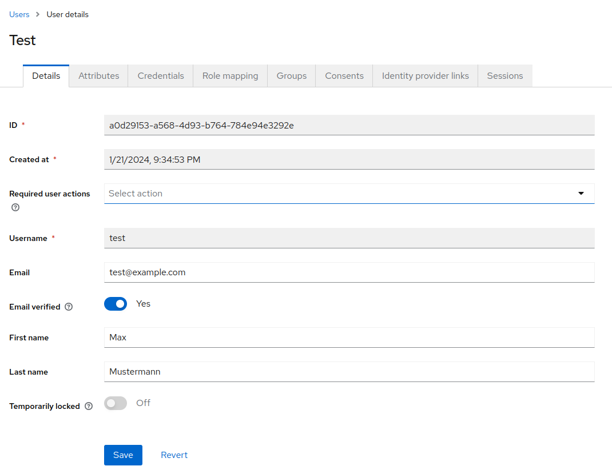

# Template Repository
[](https://opensource.org/license/bsd-3-clause/)

[](https://github.com/digitharium/hiami-mattermost-keycloak/actions/workflows/main.yml)

## Introduction
This repository serves as information collection on how to setup mattermost integrated with Keycloak for Single Sign On.

[Mattermost](https://mattermost.com/) calls itself a secure collaboration platform for accelerating mission critical work in complex environments.
It exists in different flavors:
- free (self-hosted)
- commercial

The main difference for our usecase is that the commercial version of mattermost has support for [OpenID Connect](https://openid.net/developers/how-connect-works/).

In the following sections we want to outline how Mattermost can be connected to [Keycloak](https://www.keycloak.org/) and Open Source Identity and Access Management System in order to enable single-sign-on (SSO).

## Contributors
* [Christoph](https://github.com/guschtel), [Black Forest Software Engineering](https://blackforest.software)

## Instructions

The steps to get this integration done can be outlined as follow (development only!):
- Setup Keycloak and create a realm and OIDC Client that can be used with mattermost
- Spin up a Mattermost system using docker-compose
- Configure Mattermost to connect to Keycloak instead of Gitlab for SSO

### Setup Keycloak

Setting up Keycloak is a simple matter of running it locally with docker-compose, following the [instructions on Keycloaks website](https://www.keycloak.org/server/containers).

First create a local folder `keycloak/data` which will be used to store all relevant configuration that we will use later on.

```bash
m̀kdir -p keycloak/data
```

Then the most simple setup can be done with the following command to start the latest keycloak version through docker:

```bash
docker run --name keycloak_icrc -p 8080:8080 \
  -e KEYCLOAK_ADMIN=admin -e KEYCLOAK_ADMIN_PASSWORD=adminpassword \
  -v /path/to/keycloak/data:/opt/keycloak/data/import \
  quay.io/keycloak/keycloak:latest \
  start-dev --import-realm
```

Change `keycloak_icrc` to the name you want to name your docker container and of course adjust the admin username and password.
To generate a random password, you can use `pwgen` for example.
```bash
pwgen 32 1
```
After Keycloak started, create a realm and an OIDC Client that has the [Authorization Code flow](https://www.keycloak.org/docs/latest/securing_apps/#authorization-code) as well as `Client authentication` enabled.
Then go to the `Client scopes` tab and click on the link labeled `yourclient-dedicated` where yourclient is the name of the client that you have just created, for example `mattermost`.

In there, define three token mappers:
- username
- email
- mattermostId

##### username
The username token mapper is used to insert the username of the user in the format expected by keycloak:


##### email
The email adds the email address in a similar fashion.


##### mattermostId
The third token mapper is probably the most important one. This one takes care of adding an `id` corresponding to the mattermost-id in the token.
This will allow mattermost to identify the user.


What this token mapper does, is adding the custom user attribute `mattermostId` as a long value in the token.
It is important that this is a long and not a string. Unfortunately the keycloak user-id is a UUID, therefore we cannot use this as a unique identifier for mattermost.

#### Creating a user
Now when creating a user, we need to ensure that the mattermostId Attribute is unique for every user. If that is not the case, users will be able to impersonate another user on mattermost.




### Check the Keycloak `.well-known` OpenID Endpoint Configuration:
Check the Keycloak `.well-known` OpenID Endpoint Configuration for your realm, in our case [Humanitarians](http://localhost:8080/realms/Humanitarians/.well-known/openid-configuration).

```json
{
  "issuer": "http://localhost:8080/realms/Humanitarians",
  "authorization_endpoint": "http://localhost:8080/realms/Humanitarians/protocol/openid-connect/auth",
  "token_endpoint": "http://localhost:8080/realms/Humanitarians/protocol/openid-connect/token",
  "introspection_endpoint": "http://localhost:8080/realms/Humanitarians/protocol/openid-connect/token/introspect",
  "userinfo_endpoint": "http://localhost:8080/realms/Humanitarians/protocol/openid-connect/userinfo",
  "end_session_endpoint": "http://localhost:8080/realms/Humanitarians/protocol/openid-connect/logout",
  ...
}
```

### Setup mattermost
Mattermost can be started with a simple docker run command:
```bash
docker run --name mattermost-preview --publish 8065:8065 mattermost/mattermost-preview
```
This setup again ist just for development / test purposes, obviously.

Then exec into the docker container to change the required configuration:
```bash
docker exec -it acf1c111ec21 bash
```

Inside the docker, in a folder called `/mm/mattermost/config` you will find the configuration for the docker instance that you are currently running.
```bash
cd /mm/mattermost/config
```

Edit this file after installing an editor like `nano` or `vim`:

```
vim config_docker.json
```

Search for a section called `GitLabSettings` and edit is as follows:
```json
  "GitLabSettings": {
        "Enable": true,
        "Secret": "xxx-replaced-for-security-reasons",
        "Id": "mattermost",
        "Scope": "",
        "AuthEndpoint": "http://192.168.0.47:8080/realms/Humanitarians/protocol/openid-connect/auth",
        "TokenEndpoint": "http://192.168.0.47:8080/realms/Humanitarians/protocol/openid-connect/token",
        "UserAPIEndpoint": "http://192.168.0.47:8080/realms/Humanitarians/protocol/openid-connect/userinfo",
        "DiscoveryEndpoint": "http://192.168.0.47:8080/realms/Humanitarians/.well-known/openid-configuration",
        "ButtonText": "Login with ICRC Keycloak",
        "ButtonColor": "#ADD015"
    },
```

Make sure you edit the Endpoint URLs, leave the scope empty and change the ButtonText and Color according to your wishes.
After making these changes, restart your mattermost dev instance and enjoy a Keycloak SSO login.

